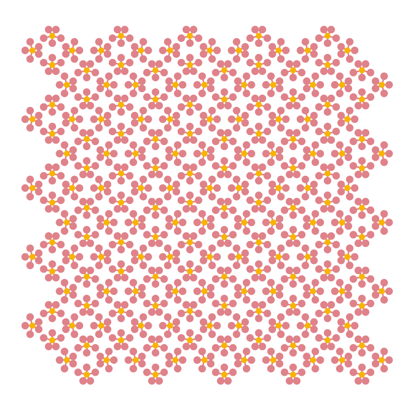

# Fancy pattern example

## Usage

Open a clojure repl inside of this project and eval next code


``` clojure
(q/defsketch nen
  :title      "super-omedetai"
  :size       [800 800]
  :setup      config
  :update     actualiza-estado
  :draw       dibuja-estado
  :features   [:keep-on-top]
  :middleware [m/fun-mode])
```

That init a processing window with content similar to:



# Autor:

@MiguelPinia
